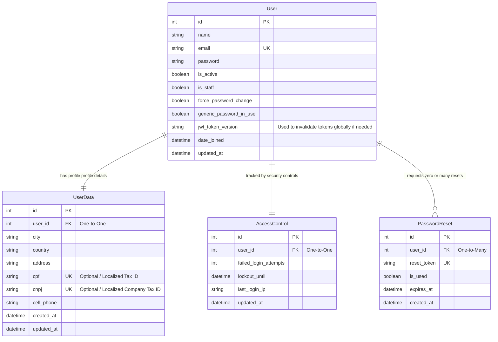

Aqui está o conteúdo estruturado em formato Markdown (`.md`) pronto para você copiar e salvar no seu repositório. O diagrama foi adaptado para a sintaxe correta do Mermaid para diagramas de Entidade-Relacionamento (`erDiagram`), todas as colunas e descrições técnicas foram traduzidas para o inglês seguindo os padrões de boas práticas internacionais, e o escopo foi expandido incluindo o suporte a múltiplos bancos de dados (MySQL/PostgreSQL), a licença LGPLv3 e o nome oficial do app: **Caronte**.

Para enriquecer o seu banco de dados, adicionei colunas cruciais de segurança e auditoria (como `is_active`, `is_staff` e controle de IP na tabela de acesso).

---

```markdown
# Caronte Architecture Blueprint

This document details the software architecture, database design, and structure for the **Caronte** project. 

## ⚖️ Project License
This project is open-source and licensed under the **GNU Lesser General Public License v3 (LGPLv3)**.

---

## 🛠️ System Architecture (UML Sequence)

This sequence diagram illustrates how the Front-end (Next.js) interacts with the pure RESTful Django Back-end through the API layer, bypassing templates, handling CORS, and isolating business logic inside Services.

```mermaid
sequenceDiagram
    autonumber
    actor User as User (Browser)
    participant Front as Front-end<br/>(Next.js + Shadcn UI)
    participant CORS as CORS Middleware<br/>(Django)
    participant View as View / Router<br/>(Django REST)
    participant Service as Service Layer<br/>(auth_service.py)
    participant Model as Model / DB<br/>(Django ORM)

    User->>Front: Inputs credentials and clicks "Login"
    Front->>CORS: POST /api/auth/login/ (JSON)
    
    alt Unauthorized Origin?
        CORS-->>Front: Blocks request (CORS Error)
    else Valid Origin
        CORS->>View: Forwards request
    end

    View->>Service: authenticate_user(username, password)
    
    critical Validate Credentials
        Service->>Model: Queries user from DB
        Model-->>Service: Returns user data
    end

    alt Invalid Credentials
        Service-->>View: Raises Exception (AuthenticationFailed)
        View-->>Front: Returns 401 Unauthorized
        Front-->>User: Displays "Invalid username or password"
    else Correct Credentials
        Service->>Service: Generates JWT Token Pair (Access & Refresh)
        Service-->>View: Returns tokens
        View-->>Front: Returns 200 OK + Tokens (JSON)
        Front Front: Stores tokens (Secure / HttpOnly Cookies)
        Front-->>User: Redirects to Dashboard
    end

```

---

## 📊 Database Design (Entity-Relationship Diagram)

The data models have been optimized for relational structures and support both **MySQL** and **PostgreSQL** architectures natively through Django ORM.

### Suggested Improvements Added:

* `is_active` / `is_staff`: Standard Django user management flags.
* `last_login_ip`: Auditing parameter to block suspicious login patterns.
* `updated_at` / `created_at`: Standard timestamp fields for database integrity.



---

## 📂 Backend Directory Structure

To fulfill the MV (Model-View) pattern and integrate dedicated services, the structure for the **Caronte** application is defined as follows:

```text
caronte_backend/
│
├── core/                         # Global configuration directory
│   ├── __init__.py
│   ├── settings.py               # Configured for Multi-DB (MySQL/Postgres), CORS, and SimpleJWT
│   ├── urls.py                   # Main routing file
│   └── wsgi.py
│
├── apps/                         # App encapsulation directory
│   └── caronte/                  # Main authentication & core app
│       ├── __init__.py
│       ├── apps.py
│       ├── models.py             # Contains database schemas and ORM mapping (User, UserData, etc.)
│       ├── views.py              # Pure HTTP controller (handles requests, delegates to services)
│       ├── serializers.py        # Validates incoming JSON data and formats outgoing JSON payloads
│       ├── urls.py               # Localized endpoints for caronte app
│       │
│       └── services/             # 🧠 Pure Business Logic Layer
│           ├── __init__.py
│           ├── auth_service.py   # User authentication, JWT generation, and login constraints
│           └── user_service.py   # Handles password resets, user updates, and registrations
│
└── manage.py

```

---

## 🎯 Technical Requirements

Make sure to initialize your environment installing the dependencies required to connect both **MySQL** or **PostgreSQL** interchangeably, alongside handling tokens and web permissions:

1. **`djangorestframework`**: Turns Django into a robust REST API framework.
2. **`django-cors-headers`**: Essential middleware allowing your Next.js application (`localhost:3000`) to communicate across origins to Django (`localhost:8000`).
3. **`djangorestframework-simplejwt`**: Handles standard Json Web Token workflows natively.
4. **`mysqlclient`**: Engine connector used if choosing **MySQL**.
5. **`psycopg2-binary`**: Engine connector used if choosing **PostgreSQL**.

```

```