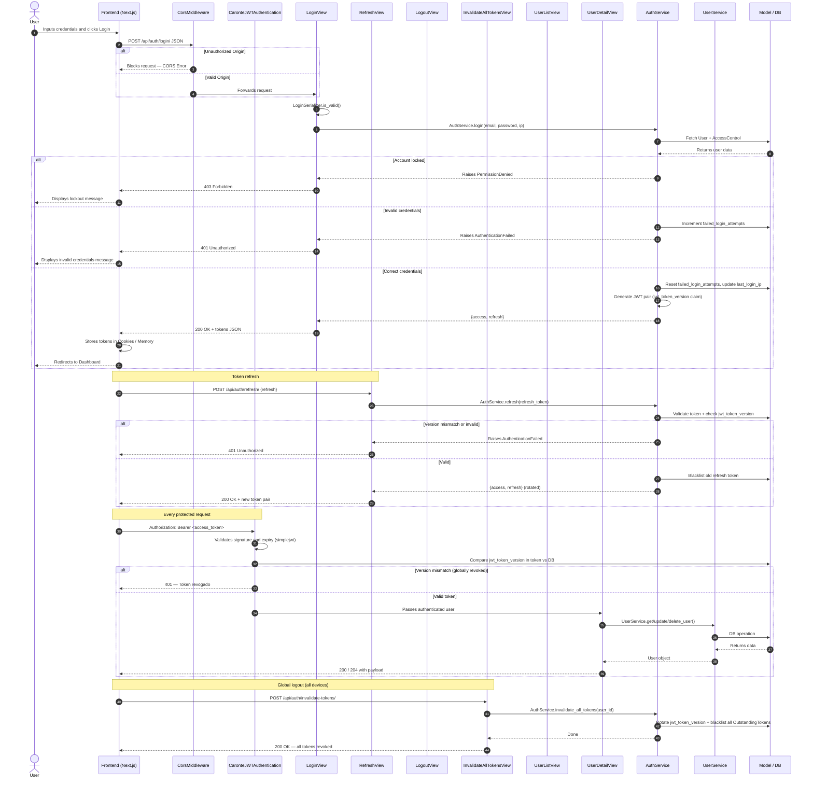
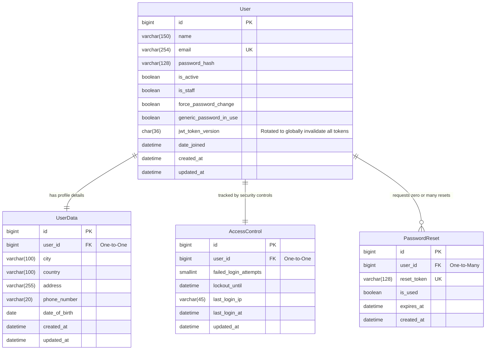

# Caronte Architecture Blueprint

This document details the software architecture, database design, API reference, and structure for the **Caronte** project.

---

This sequence diagram illustrates how the Front-end (Next.js) interacts with the pure RESTful Django Back-end through the API layer, bypassing templates, handling CORS, and isolating business logic inside Services.



---

## 📊 Database Design (Entity-Relationship Diagram)

The data models have been optimized for relational structures and support both **MySQL** and **PostgreSQL** architectures natively through Django ORM.



---

## 📂 Backend Directory Structure

```text
backend/
│
├── core/
│   ├── __init__.py
│   ├── settings.py           # Django settings — JWT, REST_FRAMEWORK, CORS, AUTH_USER_MODEL
│   ├── urls.py               # Root URL conf — includes apps.caronte.urls under /api/
│   ├── asgi.py
│   └── wsgi.py
│
├── apps/
│   └── caronte/
│       ├── __init__.py
│       ├── apps.py
│       ├── authentication.py  # 🔐 CaronteJWTAuthentication — validates jwt_token_version
│       ├── serializers.py     # LoginSerializer, UserSerializer, CreateUserSerializer
│       ├── urls.py            # All app routes — auth + users
│       │
│       ├── models/            # 🗄️ DB Schemas
│       │   ├── __init__.py
│       │   ├── user.py           # Custom AbstractBaseUser
│       │   ├── user_data.py      # Profile data (One-to-One)
│       │   ├── access_control.py # Login security controls (One-to-One)
│       │   └── password_reset.py # Password reset tokens (One-to-Many)
│       │
│       ├── migrations/
│       │   ├── __init__.py
│       │   └── 0001_initial.py
│       │
│       ├── views/             # 🎮 HTTP Handlers (thin — delegates to services)
│       │   ├── __init__.py          # re-exports all views
│       │   ├── login_view.py        # LoginView — POST /api/auth/login/
│       │   ├── refresh_view.py      # RefreshView — POST /api/auth/refresh/
│       │   ├── logout_view.py       # LogoutView — POST /api/auth/logout/
│       │   ├── invalidate_all_tokens_view.py  # InvalidateAllTokensView — POST /api/auth/invalidate-tokens/
│       │   ├── user_list_view.py    # UserListView — GET + POST /api/users/
│       │   ├── user_detail_view.py  # UserDetailView — GET + PATCH + DELETE /api/users/{id}/
│       │   ├── auth_views.py        # (compat) re-exports auth views
│       │   └── user_views.py        # (compat) re-exports user views
│       │
│       ├── services/          # 🧠 Business Logic Layer
│       │   ├── __init__.py
│       │   ├── auth_service.py   # JWT login/logout/refresh/revoke logic
│       │   └── user_service.py   # Full User CRUD + AccessControl + PasswordReset
│       │
│       ├── tests/
│       │   ├── __init__.py
│       │   ├── test_auth.py
│       │   ├── test_login_view.py
│       │   ├── test_refresh_view.py
│       │   ├── test_logout_view.py
│       │   ├── test_invalidate_all_tokens_view.py
│       │   ├── test_user_list_view.py
│       │   ├── test_user_detail_view.py
│       │   └── test_user.py
│       │
│       └── management/
│           └── commands/
│               └── seed_admin.py
│
└── manage.py
```

---

## 🌐 API Reference

Base URL: `http://localhost:8000/api/`

All protected endpoints require the header:
```
Authorization: Bearer <access_token>
```

### Authentication

| Method | Endpoint | Auth | Description |
|--------|----------|------|-------------|
| POST | `/api/auth/login/` | Public | Returns `access` + `refresh` tokens |
| POST | `/api/auth/refresh/` | Public | Rotates refresh token, returns new pair |
| POST | `/api/auth/logout/` | Required | Blacklists the refresh token |
| POST | `/api/auth/invalidate-tokens/` | Required | Revokes all tokens across all devices |

**Login request body:**
```json
{
  "email": "user@example.com",
  "password": "Senha@123"
}
```

**Login response:**
```json
{
  "access": "<jwt_access_token>",
  "refresh": "<jwt_refresh_token>"
}
```

### Users

| Method | Endpoint | Auth | Permission | Description |
|--------|----------|------|------------|-------------|
| GET | `/api/users/` | Required | Admin only | List all active users |
| POST | `/api/users/` | Required | Admin only | Create user + UserData + AccessControl |
| GET | `/api/users/{id}/` | Required | Authenticated | Get user by ID |
| PATCH | `/api/users/{id}/` | Required | Authenticated | Update user and/or UserData |
| DELETE | `/api/users/{id}/` | Required | Authenticated | Hard delete user (CASCADE) |

**Create user request body:**
```json
{
  "name": "João Silva",
  "email": "joao@caronte.com",
  "password": "Senha@123",
  "user_data": {
    "city": "São Paulo",
    "country": "Brasil",
    "address": "Av. Paulista, 1000",
    "phone_number": "11999990000",
    "date_of_birth": "1990-05-15"
  }
}
```

**PATCH request body (partial update):**
```json
{
  "name": "João Atualizado",
  "user_data": {
    "city": "Campinas"
  }
}
```

---

## 🔐 JWT & Security Architecture

### Token Claims

Every access and refresh token issued contains:

| Claim | Description |
|-------|-------------|
| `user_id` | Primary key of the user |
| `jwt_token_version` | UUID rotated on global logout to invalidate all tokens |
| `name` | User display name |
| `email` | User email |

### `CaronteJWTAuthentication`

Located at `apps/caronte/authentication.py`. On every authenticated request it:

1. Validates signature and expiry via `simplejwt` standard flow.
2. Extracts `jwt_token_version` from the token payload.
3. Compares it against `User.jwt_token_version` in the database.
4. Rejects the request instantly if they differ — no waiting for token expiry.

### Brute-force Lockout

Configured in `settings.py`:

```python
AUTH_MAX_FAILED_ATTEMPTS = 5   # failed attempts before lockout
AUTH_LOCKOUT_MINUTES     = 30  # lockout duration
```

`AccessControl` tracks `failed_login_attempts` and `lockout_until` per user. All lockout logic lives in `AuthService`.

---

## 🎯 Technical Requirements

| Package | Purpose |
|---------|---------|
| `django` | Web framework |
| `djangorestframework` | REST API layer |
| `djangorestframework-simplejwt` | JWT authentication + token blacklist |
| `django-cors-headers` | CORS middleware for Next.js frontend |
| `mysqlclient` | MySQL engine connector |
| `psycopg2-binary` | PostgreSQL engine connector |

---

## 🚀 Local Setup Tutorial

### 1) Prerequisites

* Python 3.11 or newer
* Node.js 18 or newer
* Git
* MySQL or PostgreSQL server

### 2) Ubuntu / WSL Ubuntu

```bash
sudo apt update
sudo apt install -y python3 python3-pip python3-venv python3-dev build-essential pkg-config git curl

# MySQL
sudo apt install -y default-libmysqlclient-dev

# PostgreSQL
sudo apt install -y libpq-dev
```

### 3) Windows

* Python from python.org — enable "Add Python to PATH"
* Git for Windows
* Node.js LTS
* Visual Studio Build Tools (required for `mysqlclient`)

```powershell
# Allow scripts (run once)
Set-ExecutionPolicy -Scope CurrentUser RemoteSigned
```

### 4) macOS

```bash
brew install python git node pkg-config

# MySQL
brew install mysql-client

# PostgreSQL
brew install libpq
```

### 5) Backend setup (all platforms)

```bash
# Inside /backend
python3 -m venv .venv
source .venv/bin/activate          # Windows: .venv\Scripts\Activate.ps1
python -m pip install --upgrade pip

pip install django djangorestframework django-cors-headers djangorestframework-simplejwt

# Choose one:
pip install mysqlclient       # MySQL
pip install psycopg2-binary   # PostgreSQL
```

### 6) Environment variables

Configure `core/settings.py` for local dev:

```env
SECRET_KEY=your-secret-key-here
DEBUG=True
ALLOWED_HOSTS=localhost,127.0.0.1
CORS_ALLOWED_ORIGINS=http://localhost:3000
AUTH_MAX_FAILED_ATTEMPTS=5
AUTH_LOCKOUT_MINUTES=30
```

### 7) Run the backend

```bash
cd backend
source .venv/bin/activate
python manage.py migrate
python manage.py seed_admin    # creates initial admin user
python manage.py runserver
```

### 8) Run the frontend (Next.js)

```bash
cd frontend
npm install
npm run dev
```

### 9) Test with Postman

Import `Caronte.postman_collection.json` from the project root into Postman.

The collection saves tokens automatically after Login and fills `{{user_id}}` after creating a user — run **Login** first and all other requests work immediately.

### 10) Final verification

* `http://localhost:8000/api/auth/login/` returns tokens
* `http://localhost:3000` loads the frontend
* Django admin available at `http://localhost:8000/admin/`

---

## ⚖️ Project License

This project is open-source and licensed under the **GNU Lesser General Public License v3 (LGPLv3)**.

LGPLv3 lets you use this project in closed or open-source software, but if you modify the LGPL-covered code itself and distribute it, you must keep those modifications under the same license and provide the corresponding source code.

In practical terms:

* You can link to the library from proprietary applications.
* If you change the library code and distribute it, those changes must remain LGPLv3.
* You must keep the license notice and copyright notices.

This is a summary for convenience only; the full LGPLv3 text controls the legal terms.