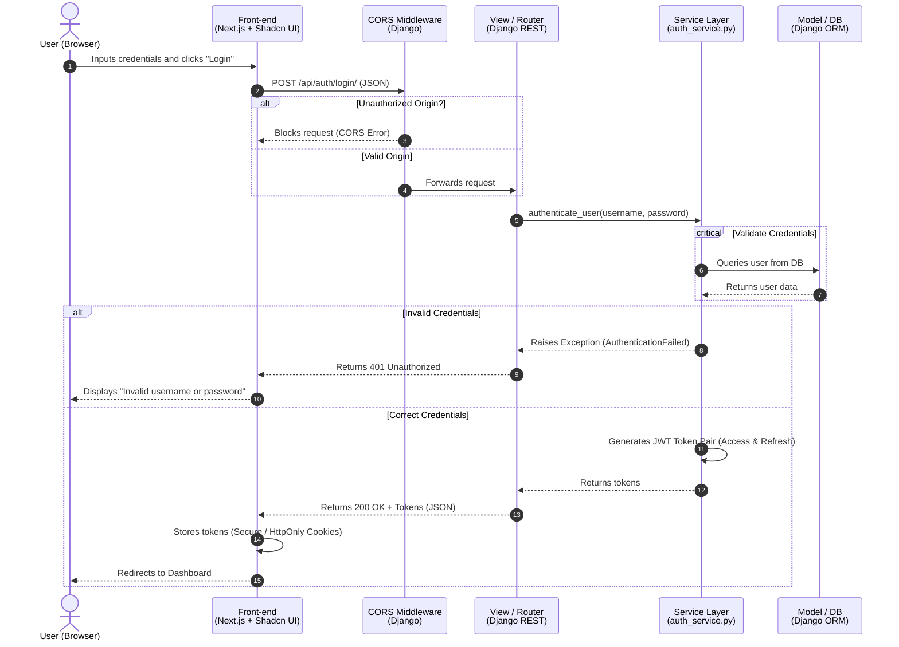
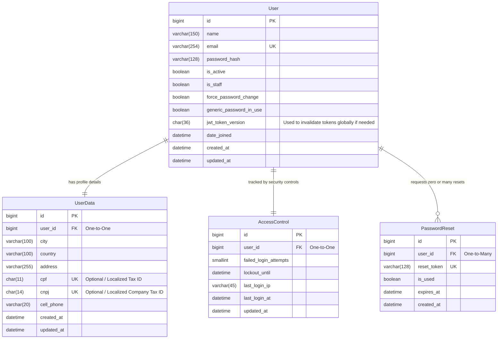

```markdown
# Caronte Architecture Blueprint

This document details the software architecture, database design, and structure for the **Caronte** project. 

## 🛠️ System Architecture (UML Sequence)

This sequence diagram illustrates how the Front-end (Next.js) interacts with the pure RESTful Django Back-end through the API layer, bypassing templates, handling CORS, and isolating business logic inside Services.



---

## 📊 Database Design (Entity-Relationship Diagram)

The data models have been optimized for relational structures and support both **MySQL** and **PostgreSQL** architectures natively through Django ORM.

### Suggested Improvements Added:

* `is_active` / `is_staff`: Standard Django user management flags.
* `last_login_ip`: Auditing parameter to block suspicious login patterns.
* `updated_at` / `created_at`: Standard timestamp fields for database integrity.



---

## 📂 Backend Directory Structure

To fulfill the MV (Model-View) pattern and integrate dedicated services, the structure for the **Caronte** application is defined as follows:

```text
caronte_backend/
│
├── core/                         # Global configuration directory
│   ├── __init__.py
│   ├── settings.py               # Configured for Multi-DB (MySQL/Postgres), CORS, and SimpleJWT
│   ├── urls.py                   # Main routing file
│   └── wsgi.py
│
├── apps/                         # App encapsulation directory
│   └── caronte/                  # Main authentication & core app
│       ├── __init__.py
│       ├── apps.py
│       ├── models.py             # Contains database schemas and ORM mapping (User, UserData, etc.)
│       ├── views.py              # Pure HTTP controller (handles requests, delegates to services)
│       ├── serializers.py        # Validates incoming JSON data and formats outgoing JSON payloads
│       ├── urls.py               # Localized endpoints for caronte app
│       │
│       └── services/             # 🧠 Pure Business Logic Layer
│           ├── __init__.py
│           ├── auth_service.py   # User authentication, JWT generation, and login constraints
│           └── user_service.py   # Handles password resets, user updates, and registrations
│
└── manage.py

```

---

## 🎯 Technical Requirements

Make sure to initialize your environment installing the dependencies required to connect both **MySQL** or **PostgreSQL** interchangeably, alongside handling tokens and web permissions:

1. **`djangorestframework`**: Turns Django into a robust REST API framework.
2. **`django-cors-headers`**: Essential middleware allowing your Next.js application (`localhost:3000`) to communicate across origins to Django (`localhost:8000`).
3. **`djangorestframework-simplejwt`**: Handles standard Json Web Token workflows natively.
4. **`mysqlclient`**: Engine connector used if choosing **MySQL**.
5. **`psycopg2-binary`**: Engine connector used if choosing **PostgreSQL**.

---

## 🚀 Local Setup Tutorial

This tutorial covers the minimum steps to run the project locally on WSL Ubuntu, Ubuntu, Windows, and macOS.

### 1) Prerequisites

Install these tools first:

* Python 3.11 or newer
* Node.js 18 or newer
* npm or pnpm
* Git
* A database server: MySQL or PostgreSQL

Recommended Python packages for the backend:

* djangorestframework
* django-cors-headers
* djangorestframework-simplejwt
* mysqlclient or psycopg2-binary, depending on the chosen database

### 2) Ubuntu / WSL Ubuntu

Install system packages:

```bash
sudo apt update
sudo apt install -y python3 python3-pip python3-venv python3-dev build-essential libpq-dev pkg-config git curl
```

If you will use MySQL, also install:

```bash
sudo apt install -y default-libmysqlclient-dev
```

If you will use PostgreSQL, also install:

```bash
sudo apt install -y libpq-dev
```

Create and activate a virtual environment:

```bash
python3 -m venv .venv
source .venv/bin/activate
python -m pip install --upgrade pip
```

Install the backend dependencies:

```bash
pip install django djangorestframework django-cors-headers djangorestframework-simplejwt
```

Install the database driver that matches your database:

```bash
pip install mysqlclient
```

or:

```bash
pip install psycopg2-binary
```

### 3) Windows

Install these tools:

* Python from python.org, and enable "Add Python to PATH"
* Git for Windows
* Node.js LTS from nodejs.org
* Visual Studio Build Tools or the C++ Build Tools workload if you use `mysqlclient`
* MySQL or PostgreSQL desktop/server installer

Create and activate the virtual environment:

```powershell
py -3 -m venv .venv
.venv\Scripts\Activate.ps1
python -m pip install --upgrade pip
```

Install the backend dependencies:

```powershell
pip install django djangorestframework django-cors-headers djangorestframework-simplejwt
```

Install the driver:

```powershell
pip install mysqlclient
```

or:

```powershell
pip install psycopg2-binary
```

If PowerShell blocks script execution, run:

```powershell
Set-ExecutionPolicy -Scope CurrentUser RemoteSigned
```

### 4) macOS

Install Homebrew first, then use it to install the base tools:

```bash
brew install python git node pkg-config
```

If you will use PostgreSQL, install the client libraries:

```bash
brew install libpq
```

If you will use MySQL, install the client libraries:

```bash
brew install mysql-client
```

Create and activate the virtual environment:

```bash
python3 -m venv .venv
source .venv/bin/activate
python -m pip install --upgrade pip
```

Install the backend dependencies:

```bash
pip install django djangorestframework django-cors-headers djangorestframework-simplejwt
```

Install the matching driver:

```bash
pip install psycopg2-binary
```

or:

```bash
pip install mysqlclient
```

### 5) Run the project locally

After installing the dependencies, run the backend and frontend with the commands defined by your project structure.

Typical Django commands:

```bash
python manage.py migrate
python manage.py runserver
```

Typical Next.js commands:

```bash
npm install
npm run dev
```

### 6) Environment variables

Create a `.env` file and configure at least:

* `SECRET_KEY`
* `DEBUG`
* `ALLOWED_HOSTS`
* `DATABASE_URL` or the equivalent database settings
* `CORS_ALLOWED_ORIGINS`

Example local CORS origin:

```text
http://localhost:3000
```

### 7) Final verification

Check that:

* Django starts without migration errors
* The database driver matches the selected database
* The frontend can call the backend API on the configured CORS origin

---

## ⚖️ Project License

This project is open-source and licensed under the **GNU Lesser General Public License v3 (LGPLv3)**.

```

```